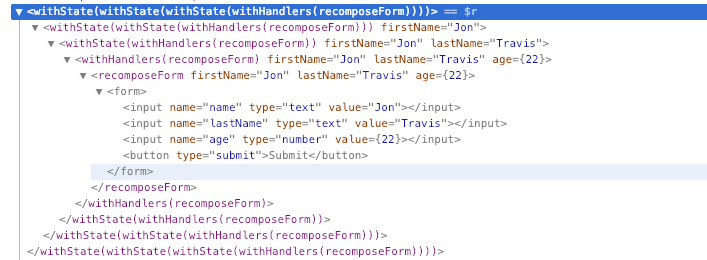
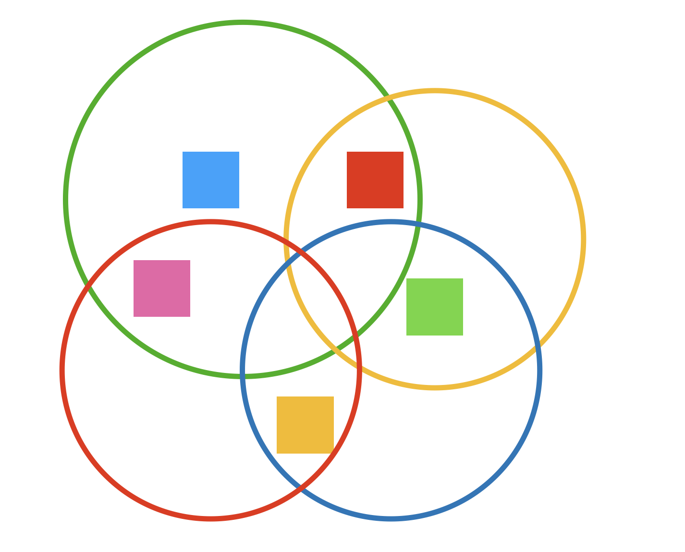

> 本文由百度资深研发工程师兼百度 ECOMFE FE-CMC 现任主席 — 张立理大佬授权转载。本系列文章对 Hook 进行了深度剖析。

继续读基于 hook 的状态管理，毕竟状态无论什么时候都是 react 的重中之重。

在有了 `useState` 这东西之后，我们会发现状态被天生地“拆散”了，比如曾经有一个类组件：

```js
class TodoList extends Component {
    state = {
        dataSource: [],
        isLoading: true,
        filterText: '',
        filterType: 'all',
    };
}
```

放到 hook 上，大概率就是这样子的了：

```js
const TodoList = () => {
    const [dataSource, setDataSource] = useState([]);
    const [isLoading, setLoading] = useState(true);
    const [filterText, filterByText] = useState('');
    const [filterType, filterByType] = useState('all');
};
```

老实说这算好的了，至少还搞了发起名的艺术，没有啥都叫 `setFooBar`。

上面的这个转换方式无疑是正确的，不过现实并不总这么友好，状态拆分的时候，容易出现粒度控制不好的情况。

## 粒度过细

如果按照标准的每一个状态对应一个 `useState` 的做法，自然是逻辑上正确的，但它容易造成状态粒度过细的问题。

讲一个故事：

> 做一个表格，带一个选中功能，其中一个点是“按住 SHIFT 的同时点击一行可以选中一个区域”。

为了实现这个功能，我们需要 2 套逻辑：

- 当点击一行时，选中这一行。
- 按 SHIFT 点击时，把上一次选中行 (或第一行) 到当前行都选中。

从这个场景我们能分析出一个结论：点击一行的时候，除了选中它，还需要记录最后一次选中的行。为了简化这个模型，代码中我先不管“取消选择”的效果：

```js
const SelectableList = () => {
    const [selection, setSelection] = useState([]);
    const [lastSelected, setLastSelected] = useState(0);
    const selectLine = useCallback(
        index => {
            setSelection(lines => lines.concat(index));
            setLastSelected(index);
        },
        []
    );
};
```

仔细看 `useCallback` 中的部分，我们能看到它会连续调用 2 个状态的更新，这会造成什么情况呢？每一次状态更新都触发一次渲染，会导致多次渲染的浪费吗？

答案是**不好说**，如果这件事发生在 React 管理的事件中，则更新会被合并起来，如果发生在其它场合 (比如异步结束时)，则会使得 React 触发多次渲染。为此我创建了一个 [CodeSandbox 示例](https://codesandbox.io/s/set-multiple-state-in-callback-6m6vd)来说明。

所以我们今天要谈的不是一个性能问题，而是一个代码的组织和可读性问题。

在 class 时代，我们会看到这样的代码：

```js
class SelectableList extends Component {
    selectLine = index => {
        this.setState(state => ({
            selection: state.selection.concat(index),
            lastSelected: index
        }));
    };
}
```

我们并不会把这代码写成：

```js
class SelectableList extends Component {
    selectLine = index => {
        this.setState(state => ({selection: state.selection.concat(index)}));
        this.setState({lastSelected: index});
    };
}
```

不否认 **class 时代状态的集中管理是过于粗放的**，但那个时代的状态更新粒度基本是没有问题的，所以在使用 hook 的时候千万不要太过暴力的拆分状态。**过于细粒度的拆分状态会导致代码阅读者难以理解状态间的关系，无形提升代码维护的难度**。

## 使用 reducer 管理状态更新

现在搞清楚了状态粒度太细是不好的，所以不妨将上面示例的状态重新再合并回来：

```js
const DEFAULT_SELECTION_STATE = {
    selection: [],
    lastSelected: 0,
};

const SelectableList = () => {
    const [selectionState, setSelectionState] = useState(DEFAULT_SELECTION_STATE);
    const selectLine = useCallback(
        index => {
            const updater = ({selection}) => {
                return {
                    selection: selection.concat(index),
                    lastSelected: index,
                };
            };
            setSelectionState(updater);
        },
        []
    );
};
```

没什么难度，确实没什么难度。

但这种做法，依然会有一个问题：**状态的更新与状态的声明距离过远**。在这个示例中很难看出问题，因为总共也就 20 行，状态声明后立刻有 `useCallback` 的调用说明怎么更新它。但在现实中，我们很容易面对 300 + 行的组件，面对状态的声明在第 1 行，状态的更新在第 40 行，甚至在最终 JSX 中的某个 `onClick` 里的一个箭头函数中。

在这样的代码里，阅读者想搞清楚一个状态被如何使用、如何更新是非常困难的，这不仅降低代码的可维护性，还给代码的学习者很大的挫败感，久而久之的影响就是**谁也不愿意接手这代码**。

解决这个问题通常有 2 种方法：

1. 把状态和更新封装到自定义的 hook 中，比如就叫 `useSelection`。
2. 使用 `useReducer` 来实现。

第一种方法自不必说，能不能找到合适的粒度来实现自定义 hook 就是对 react 开发者的素质的考验。但不少时候自定义 hook 作为一种解决方案还是过于重量级，虽然它仅仅是一个函数，但依然会需要阅读者去理解输入输出，使用 TypeScript 还可能造成类型定义上的额外工作。

使用 `useReducer` 可以在不少轻量级的场景里快速地将状态声明和状态更新放在一起，比如上面的例子：

```js
const SelectableList = () => {
    const [selectionState, dispatchSelectionState] = useReducer(
        (state, action) => {
            switch (action.type) {
                case 'select':
                    return {
                        selection: state.selection.concat(action.payload),
                        lastSelected: action.payload,
                    };
                default:
                    return state;
            }
        },
        {selection: [], lastSelected: 0}
    );
};
```

可以看到的是，通过 `useReducer` 我们传递一个函数，这个函数清晰地表达了 `'select'` 这个类型的操作，以及对应的状态更新。`useReducer` 的第二个参数也很好地说明了状态的结构。

当然如果使用本系列前一篇中讲述的 `useImmer` 或 `useMethods` 会更容易实现：

```js
const SelectableList = () => {
    const [selectionState, {select}] = useMethods(
        methods,
        {selection: [], lastSelected: 0}
    );
};
```

## 状态过粗

反过来说，状态也可能太粗，比如我们硬是将整个 class 的状态移到一个 `useState` 里：

```js
const DEFAULT_STATE = {
    dataSource: [],
    isLoading: true,
    filterText: '',
    filterType: 'all',
};

const TodoList = () => {
    const [state, setState] = useState(DEFAULT_STATE);
};
```

我个人是不太能想象谁会去写这样的代码的，也许背了一个“把 class 全部变成 hook”的 KPI 的可怜孩子会玩这一套……

不过在此依然需要提一下状态过粗的代价，试想这样的组件：

```js
class UserInfo extends Component {
    state = {
        isBaseLoading: true,
        isDetailLoading: false,
        baseInfo: null,
        detailInfo: null,
        isDetailVisible: false,
    };

    async showDetail = () => {
        if (this.state.detailInfo) {
            this.setState({isDetailVisible: true});
        }
        else {
            this.setState({isDetailLoading: true});
            const detail = await fetchDetail();
            this.setState({
                isDetailLoading: false,
                detailInfo: detail,
                isDetailVisible: true,
            });
        }
    }
}
```

然后我们还有一个这样的组件：

```js
class TodoList {
    state = {
        filterText: '',
        filterType: 'all',
        showFilterPanel: false,
    };

    toggleFilterPanel = () => {
        this.setStae(s => ({showFilterPanel: !s.showFilterPanel}));
    };
}
```


这有什么问题呢？仔细去看 2 个组件，我们会发现它们其实是有共同的部分的：

1. 有一个能展开/收起的状态，一个叫 `isDetailVisible` 一个叫 `showFilterPanel`。
2. 有多个和异步过程有关的状态，比如 `isBaseLoading` 和 `isDetailLoading`。
3. 有异步状态与结果的成对出现，比如 `isBaseLoading` 配对 `baseInfo`，`isDetailLoading` 配对 `detailInfo`。

但能得到这些结论，很大程度上归功于我给的代码过于精简，以及给了阅读者明确的“去发现”的目的。

试想你有一个超过 10 万行代码的项目，里面有 800 多个组件，有些组件有 1200 多行，你作为一个技术负责人空降到项目中，有信心去发现这些东西吗？反正我作为一个所谓的高 T，很实诚地说我做不到。

所以状态粒度过粗的问题就在于，它会隐藏掉可以复用的状态，让人不知不觉通过“行云流水地重复编码”来实现功能，离复用和精简越来越远。

当然，有时候保持一定程度上的重复是有意义的，比如使代码更具语义化，让人更看得懂代码在干啥，这在 class 时代特别明显。在 class 明代能解决这一问题的办法就是 HOC，比如我们做 `withLoading`、`withToggle`、`withRemoteData` 等等……

然后就会变成这样：



好在 hook 能比较合理地去解决这种嵌套问题。

## 合理设计粒度

本章讲了 2 个主要的论述：状态粒度太细不好，粒度太粗也不好。

在实际的业务里，比这复杂的多的事情天天在发生，远不是太细了合一合、太粗了分一分这么简单，大部分时候我们面对的是这样的情况：



5 个状态 4 个组合操作，怎么设计粒度更合理，就慢慢折腾去吧。
