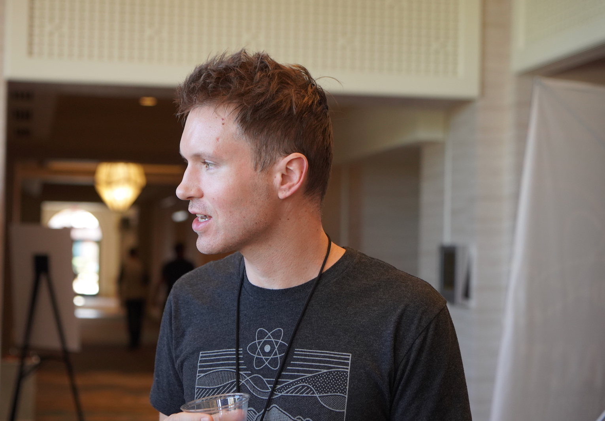
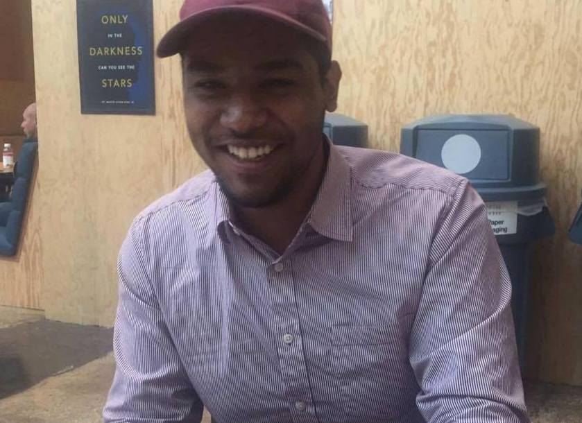

React 的开发工作由 Facebook 专门工作小组全职领导。它也接受来自世界各地开发者们的贡献。

## 走近 React 团队 {#meet-the-react-team}

React 团队成员全职专注于从事核心组件 API、React DOM 和 React Native 的引擎、React DevTools 以及 React 文档等工作。

目前 React 团队成员如下（按字母排序）。

### Andrew Clark {#andrew-clark}

[@acdlite on GitHub](https://github.com/acdlite) &middot; [@acdlite on Twitter](https://twitter.com/acdlite)

Andrew 通过 WordPress 制作网站开始接触 Web 开发，最终走上了 JavaScript 这条不归路。他最喜欢的业余活动是去 KTV 唱歌。Andrew 时而是迪士尼恶棍，时而是迪士尼公主，这取决于他当天的状态。

### Brian Vaughn {#brian-vaughn}

[@bvaughn on GitHub](https://github.com/bvaughn) &middot; [@brian\_d\_vaughn on Twitter](https://twitter.com/brian_d_vaughn)

Brian 在大学中主修艺术，为了支付学费而兼职学习了编程。后来，他意识到自己更喜欢从事开源方面的工作。Brian 有一个 [单人乐队](https://soundcloud.com/brianvaughn/) 和两个 [双人](https://soundcloud.com/pilotlessdrone) [乐队](https://soundcloud.com/pinwurm)。同时，他还拥有一只可爱的猫咪。

### Dan Abramov {#dan-abramov}

[@gaearon on GitHub](https://github.com/gaearon) &middot; [@dan_abramov on Twitter](https://twitter.com/dan_abramov)

Dan 是无意中发现微软 PowerPoint 中的 Visual Basic 后开始接触编程。他通过将 [Sebastian](#sebastian-markbage) 的推文转为长篇博文后，找到了自己真正的使命。Dan 偶尔会沉浸于《堡垒之夜》胜利的喜悦当中。

### Luna Ruan {#luna-ruan}

[@lunaruan on GitHub](https://github.com/lunaruan) &middot; [@lunaruan on Twitter](https://twitter.com/lunaruan)

Luna 学习编程是因为她觉得通过编程可以创造电子游戏。然而，她最终就职于 Pinterest 担任 Web 开发，现在又投身于 React 本身的开发当中。Luna 不再向往做电子游戏，但如果她感到无聊时，她会计划做创意写作。

### Marco Salazar {#marco-salazar}

[@salazarm on GitHub](https://github.com/salazarm) &middot; [@BkOptimism on Twitter](https://twitter.com/BkOptimism)

Marco 的第一门编程语言是汇编，因为他可以通过汇编来侵入电子游戏。如今，网络游戏愈发安全，所以他退而求其次的选择公平竞技（大部分情况下）。闲暇时，他会在跑步机上玩游戏，并制作一些他从未完成的艺术品。希望他的 PR 不会有相同的命运。

### Rachel Nabors {#rachel-nabors}

[@rachelnabors on GitHub](https://github.com/rachelnabors) &middot; [@rachelnabors on Twitter](https://twitter.com/rachelnabors)

Rachel 曾经编写过一本 [关于 UI 动画的书](https://abookapart.com/products/animation-at-work)，并与 MDN 和 W3C 合作开发了 Web 动画 API。现在她整忙于 React 团队的教程和社区工程。暗地里，她是一个获奖的少女漫画家。在公司厨房里，曾看到过她泡花茶。

### Rick Hanlon {#rick-hanlon}

[@rickhanlonii on GitHub](https://github.com/rickhanlonii) &middot; [@rickhanlonii on Twitter](https://twitter.com/rickhanlonii)

Ricky 主修理论数学，在加入 React 团队前，他在 React Native 团队呆了几年。当他不编程时，你可以找他一起玩滑雪板、骑山地车、爬山、打高尔夫，或者关闭那些与 issue 模板不一致的 Github issue。

### Sebastian Markbåge {#sebastian-markbage}

[@sebmarkbage on GitHub](https://github.com/sebmarkbage) &middot; [@sebmarkbage on Twitter](https://twitter.com/sebmarkbage)

Sebastian majored in psychology. He's usually quiet. Even when he says something, it often doesn't make sense to the rest of us until a few months later. The correct way to pronounce his surname is "mark-boa-geh" but he settled for "mark-beige" out of pragmatism -- and that's how he approaches React.

### Seth Webster {#seth-webster}

[@sethwebster on GitHub](https://github.com/sethwebster) &middot; [@sethwebster on Twitter](https://twitter.com/sethwebster)

Seth 从小就学习编程，在亚利桑那州图森市长大。放学后，他沉浸在音乐的殿堂里，在回归工作岗位前，他做了大约 10 年的巡回音乐人，后来就职于 Intuit。在业余时，他喜欢 [摄影](https://www.sethwebster.com) 还会参与美国东北部的动物救援机构。

### Xuan Huang {#xuan-huang}

[@huxpro on GitHub](https://github.com/huxpro) &middot; [@huxpro on Twitter](https://twitter.com/huxpro)

Xuan 小时候接触过编程，用 Flash 制作游戏。他在大学里从事数字媒体艺术，但最终制作编译器吸引住了——正好 React 需要一个。工作之余，喜欢拿铁艺术，热爱网球和乒乓球。

## 鸣谢 {#acknowledgements}

React 最初由 [Jordan Walke](https://github.com/jordwalke) 创立。如今，React 已拥有超过 1k+ 的开源贡献者，我们想表彰一些人，他们在过去对 React 及其文档方面做出了重大贡献，并且多年来一直帮助维护它们：

* [Almero Steyn](https://github.com/AlmeroSteyn)
* [Andreas Svensson](https://github.com/syranide)
* [Alex Krolick](https://github.com/alexkrolick)
* [Alexey Pyltsyn](https://github.com/lex111)
* [Brandon Dail](https://github.com/aweary)
* [Caleb Meredith](https://github.com/calebmer)
* [Chang Yan](https://github.com/cyan33)
* [Cheng Lou](https://github.com/chenglou)
* [Christoph Nakazawa](https://github.com/cpojer)
* [Christopher Chedeau](https://github.com/vjeux)
* [Clement Hoang](https://github.com/clemmy)
* [Dominic Gannaway](https://github.com/trueadm)
* [Flarnie Marchan](https://github.com/flarnie)
* [Jason Quense](https://github.com/jquense)
* [Jesse Beach](https://github.com/jessebeach)
* [Jessica Franco](https://github.com/Jessidhia)
* [Jim Sproch](https://github.com/jimfb)
* [Josh Duck](https://github.com/joshduck)
* [Joe Critchley](https://github.com/joecritch)
* [Jeff Morrison](https://github.com/jeffmo)
* [Keyan Zhang](https://github.com/keyz)
* [Nat Alison](https://github.com/tesseralis)
* [Nathan Hunzaker](https://github.com/nhunzaker)
* [Nicolas Gallagher](https://github.com/necolas)
* [Paul O'Shannessy](https://github.com/zpao)
* [Pete Hunt](https://github.com/petehunt)
* [Philipp Spiess](https://github.com/philipp-spiess)
* [Sander Spies](https://github.com/sanderspies)
* [Sasha Aickin](https://github.com/aickin)
* [Sophia Shoemaker](https://github.com/mrscobbler)
* [Sophie Alpert](https://github.com/sophiebits)
* [Sunil Pai](https://github.com/threepointone)
* [Tim Yung](https://github.com/yungsters)
* [Yuzhi Zheng](https://github.com/yuzhi)

这份名单并不详尽。

我们要特别感谢 [Tom Occhino](https://github.com/tomocchino) 和 [Adam Wolff](https://github.com/wolffiex)，感谢他们多年来的指导和支持。我们还要感谢所有 [将 React 翻译为其他语言的志愿者们](https://translations.reactjs.org/)。
