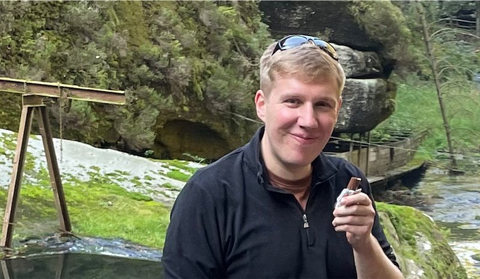
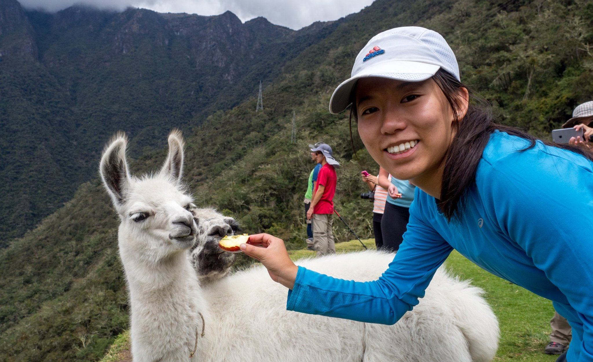

React 的开发工作由 Meta 专门工作小组全职领导。它也接受来自世界各地开发者们的贡献。

## 走近 React 团队 {#meet-the-react-team}

React 团队成员全职专注于从事核心组件 API、React DOM 和 React Native 的引擎、React DevTools 以及 React 文档等工作。

目前 React 团队成员如下（按字母排序）。

### Andrew Clark {#andrew-clark}

[@acdlite on GitHub](https://github.com/acdlite) &middot; [@acdlite on Twitter](https://twitter.com/acdlite)

Andrew 通过 WordPress 制作网站开始接触 Web 开发，最终走上了 JavaScript 这条不归路。他最喜欢的业余活动是去 KTV 唱歌。Andrew 时而是迪士尼恶棍，时而是迪士尼公主，这取决于他当天的状态。

### Dan Abramov {#dan-abramov}

[@gaearon on GitHub](https://github.com/gaearon) &middot; [@dan_abramov on Twitter](https://twitter.com/dan_abramov)

Dan 是无意中发现微软 PowerPoint 中的 Visual Basic 后开始接触编程。他通过将 [Sebastian](#sebastian-markbage) 的推文转为长篇博文后，找到了自己真正的使命。Dan 偶尔会沉浸于《堡垒之夜》胜利的喜悦当中。

### Jason Bonta {#jason-bonta}

Jason likes having large volumes of Amazon packages delivered to the office so that he can build forts. Despite literally walling himself off from his team at times and not understanding how for-of loops work, we appreciate him for the unique qualities he brings to his work. 

### Joe Savona {#joe-savona}

[@josephsavona on GitHub](https://github.com/josephsavona) &middot; [@en_JS on Twitter](https://twitter.com/en_JS)

Joe was planning to major in math and philosophy but got into computer science after writing physics simulations in Matlab. Prior to React, he worked on Relay, RSocket.js, and the Skip programming language. While he’s not building some sort of reactive system he enjoys running, studying Japanese, and spending time with his family.

### Josh Story {#josh-story}

[@gnoff on GitHub](https://github.com/gnoff) &middot; [@joshcstory on Twitter](https://twitter.com/joshcstory)

Josh majored in Mathematics and discovered programming while in college. His first professional developer job was to program insurance rate calculations in Microsoft Excel, the paragon of Reactive Programming which must be why he now works on React. In between that time Josh has been an IC, Manager, and Executive at a few startups. outside of work he likes to push his limits with cooking.

### Lauren Tan {#lauren-tan}

[@poteto on GitHub](https://github.com/poteto) &middot; [@potetotes on Twitter](https://twitter.com/potetotes)

Lauren’s programming career peaked when she first discovered the `<marquee>` tag. She’s been chasing that high ever since. When she’s not adding bugs into React, she enjoys dropping cheeky memes in chat, and playing all too many video games with her partner, and her dog Zelda.

### Luna Ruan {#luna-ruan}

[@lunaruan on GitHub](https://github.com/lunaruan) &middot; [@lunaruan on Twitter](https://twitter.com/lunaruan)

Luna 学习编程是因为她觉得通过编程可以创造电子游戏。然而，她最终就职于 Pinterest 担任 Web 开发，现在又投身于 React 本身的开发当中。Luna 不再向往做电子游戏，但如果她感到无聊时，她会计划做创意写作。

### Mofei Zhang {#mofei-zhang}

[@mofeiZ on GitHub](https://github.com/mofeiZ)]

Mofei 在发现编程可以帮助她在电子游戏中作弊时，入门了编程。她在本科/研究生阶段专注于操作系统方向，但现在她发现自己喜欢为 React 解决问题。工作之余，她喜欢攀岩以计划下一次背包旅行。

### Rick Hanlon {#rick-hanlon}

[@rickhanlonii on GitHub](https://github.com/rickhanlonii) &middot; [@rickhanlonii on Twitter](https://twitter.com/rickhanlonii)

Ricky 主修理论数学，在加入 React 团队前，他在 React Native 团队呆了几年。当他不编程时，你可以找他一起玩滑雪板、骑山地车、爬山、打高尔夫，或者关闭那些与 issue 模板不一致的 Github issue。

### Samuel Susla {#samuel-susla}

[@sammy-SC on GitHub](https://github.com/sammy-SC) &middot; [@SamuelSusla on Twitter](https://twitter.com/SamuelSusla)

Samuel’s interest in programming started with the movie Matrix. He still has Matrix screen saver. Before working on React, he was focused on writing iOS apps. Outside of work, Samuel enjoys playing beach volleyball, squash, badminton and spending time with his family.

### Sathya Gunasekaran {#sathya-gunasekaran}

[@gsathya on GitHub](https://github.com/gsathya) &middot; [@_gsathya on Twitter](https://twitter.com/_gsathya)

Sathya hated the Dragon Book in school but somehow ended up working on compilers all his career. When he's not compiling React components, he's either drinking coffee or eating yet another Dosa.

### Sebastian Markbåge {#sebastian-markbage}

[@sebmarkbage on GitHub](https://github.com/sebmarkbage) &middot; [@sebmarkbage on Twitter](https://twitter.com/sebmarkbage)

Sebastian majored in psychology. He's usually quiet. Even when he says something, it often doesn't make sense to the rest of us until a few months later. The correct way to pronounce his surname is "mark-boa-geh" but he settled for "mark-beige" out of pragmatism -- and that's how he approaches React.

### Sebastian Silbermann {#sebastian-silbermann}

[@eps1lon on GitHub](https://github.com/eps1lon) &middot; [@sebsilbermann on Twitter](https://twitter.com/sebsilbermann)

Sebastian learned programming to make the browser games he played during class more enjoyable. Eventually this lead to contributing to as much open source code as possible. Outside of coding he's busy making sure people don't confuse him with the other Sebastians and Zilberman of the React community.

### Seth Webster {#seth-webster}

[@sethwebster on GitHub](https://github.com/sethwebster) &middot; [@sethwebster on Twitter](https://twitter.com/sethwebster)

Seth 从小就学习编程，在亚利桑那州图森市长大。放学后，他沉浸在音乐的殿堂里，在回归工作岗位前，他做了大约 10 年的巡回音乐人，后来就职于 Intuit。在业余时，他喜欢 [摄影](https://www.sethwebster.com) 还会参与美国东北部的动物救援机构。

### Sophie Alpert {#sophie-alpert}

[@sophiebits on GitHub](https://github.com/sophiebits) &middot; [@sophiebits on Twitter](https://twitter.com/sophiebits)

Four days after React was released, Sophie rewrote the entirety of her then-current project to use it, which she now realizes was perhaps a bit reckless. After she became the project's #1 committer, she wondered why she wasn't getting paid by Facebook like everyone else was and joined the team officially to lead React through its adolescent years. Though she quit that job years ago, somehow she's still in the team's group chats and “providing value”.

### Tianyu Yao {#tianyu-yao}

[@tyao1 on GitHub](https://github.com/tyao1) &middot; [@tianyu0 on Twitter](https://twitter.com/tianyu0)

Tianyu’s interest in computers started as a kid because he loves video games. So he majored in computer science and still plays childish games like League of Legends. When he is not in front of a computer, he enjoys playing with his two kittens, hiking and kayaking.

### Yuzhi Zheng {#yuzhi-zheng}

[@yuzhi on GitHub](https://github.com/yuzhi) &middot; [@yuzhiz on Twitter](https://twitter.com/yuzhiz)

Yuzhi studied Computer Science in school. She liked the instant gratification of seeing code come to life without having to physically be in a laboratory. Now she’s a manager in the React org. Before management, she used to work on the Relay data fetching framework. In her spare time, Yuzhi enjoys optimizing her life via gardening and home improvement projects.

## 鸣谢 {#acknowledgements}

React 最初由 [Jordan Walke](https://github.com/jordwalke) 创立。如今，React 已拥有超过 1k+ 的开源贡献者，我们想表彰一些人，他们在过去对 React 及其文档方面做出了重大贡献，并且多年来一直帮助维护它们：

* [Almero Steyn](https://github.com/AlmeroSteyn)
* [Andreas Svensson](https://github.com/syranide)
* [Alex Krolick](https://github.com/alexkrolick)
* [Alexey Pyltsyn](https://github.com/lex111)
* [Brandon Dail](https://github.com/aweary)
* [Brian Vaughn](https://github.com/bvaughn)
* [Caleb Meredith](https://github.com/calebmer)
* [Chang Yan](https://github.com/cyan33)
* [Cheng Lou](https://github.com/chenglou)
* [Christoph Nakazawa](https://github.com/cpojer)
* [Christopher Chedeau](https://github.com/vjeux)
* [Clement Hoang](https://github.com/clemmy)
* [Dominic Gannaway](https://github.com/trueadm)
* [Flarnie Marchan](https://github.com/flarnie)
* [Jason Quense](https://github.com/jquense)
* [Jesse Beach](https://github.com/jessebeach)
* [Jessica Franco](https://github.com/Jessidhia)
* [Jim Sproch](https://github.com/jimfb)
* [Josh Duck](https://github.com/joshduck)
* [Joe Critchley](https://github.com/joecritch)
* [Jeff Morrison](https://github.com/jeffmo)
* [Keyan Zhang](https://github.com/keyz)
* [Marco Salazar](https://github.com/salazarm)
* [Nat Alison](https://github.com/tesseralis)
* [Nathan Hunzaker](https://github.com/nhunzaker)
* [Nicolas Gallagher](https://github.com/necolas)
* [Paul O'Shannessy](https://github.com/zpao)
* [Pete Hunt](https://github.com/petehunt)
* [Philipp Spiess](https://github.com/philipp-spiess)
* [Rachel Nabors](https://github.com/rachelnabors)
* [Robert Zhang](https://github.com/robertzhidealx)
* [Sander Spies](https://github.com/sanderspies)
* [Sasha Aickin](https://github.com/aickin)
* [Sophia Shoemaker](https://github.com/mrscobbler)
* [Sunil Pai](https://github.com/threepointone)
* [Tim Yung](https://github.com/yungsters)
* [Xuan Huang](https://github.com/huxpro)

这份名单并不详尽。

我们要特别感谢 [Tom Occhino](https://github.com/tomocchino) 和 [Adam Wolff](https://github.com/wolffiex)，感谢他们多年来的指导和支持。我们还要感谢所有 [将 React 翻译为其他语言的志愿者们](https://translations.reactjs.org/)。
