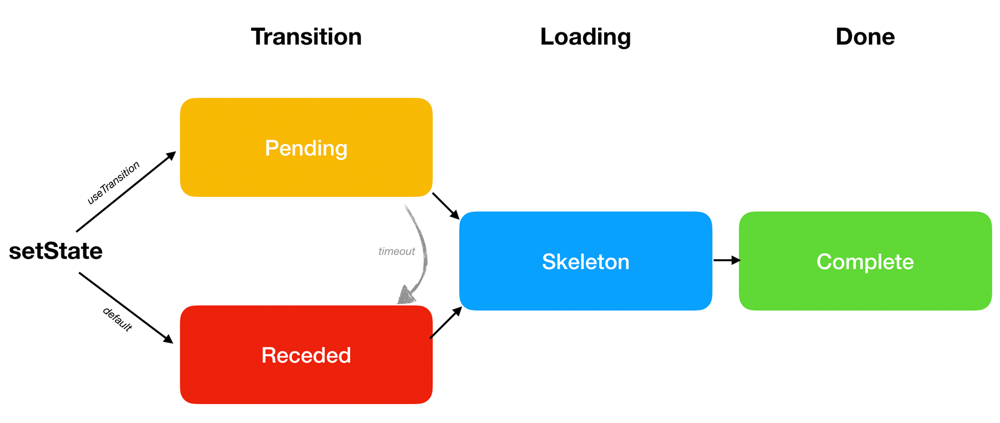

<style>
.scary > blockquote {
  background-color: rgba(237, 51, 21, 0.2);
  border-left-color: #ed3315;
}
</style>

<div class="scary">

>注意：
>
>本章节所描述的功能还处于实验阶段，在稳定版本中尚不可用。它面向的人群是早期使用者以及好奇心较强的人。
>
>本页面中许多信息现已过时，仅仅是为了存档而存在。欲了解最新信息，**请参阅 [React 18 Alpha 版公告](/blog/2021/06/08/the-plan-for-react-18.html)**。
>
>在 React 18 发布前，我们将用稳定的文档替代此章节。

</div>

通常，当我们更新 state 的时候，我们会期望这些变化立刻反映到屏幕上。我们期望应用能够持续响应用户的输入，这是符合常理的。但是，有时我们会期望**更新延迟响应在屏幕上**。

举个例子，假如我们从一个页面切换到另一个页面，但是在下一页面中代码和数据还没有加载好，则会看到空白页，并显示着加载中的加载指示器，这会让人很不舒服。这种情况下我们可能更希望在前一个页面多停留一会儿。在 React 中实现这个功能在之前是很难做到的。Concurrent 模式提供了一系列的新工具使之成为可能。

- [Transition](#transitions)
  - [用 Transition 包裹 setState](#wrapping-setstate-in-a-transition)
  - [添加一个等待提示器](#adding-a-pending-indicator)
  - [回顾更改](#reviewing-the-changes)
  - [是在那里更新的？](#where-does-the-update-happen)
  - [很多场景可以使用 transition](#transitions-are-everywhere)
  - [把 Transition 融合到你应用的设计系统](#baking-transitions-into-the-design-system)
- [3个阶段](#the-three-steps)
  - [默认方式：Receded → Skeleton → Complete](#default-receded-skeleton-complete)
  - [期望方式: Pending → Skeleton → Complete](#preferred-pending-skeleton-complete)
  - [使用 `<Suspense>` 包裹惰性功能](#wrap-lazy-features-in-suspense)
  - [Suspense 更新“列车” ](#suspense-reveal-train)
  - [延迟显示等待提示](#delaying-a-pending-indicator)
  - [回顾](#recap)
- [其他模式](#other-patterns)
  - [根据优先级分割 state](#splitting-high-and-low-priority-state)
  - [延迟一个值](#deferring-a-value)
  - [SuspenseList](#suspenselist)
- [下一步](#next-steps)

## Transition {#transitions}

<<<<<<< HEAD
我们先来回顾一下前一篇关于 [Suspense 用于数据获取](/docs/concurrent-mode-suspense.html) 文章中的 [这个示例](https://codesandbox.io/s/infallible-feather-xjtbu)。
=======
Let's revisit [this demo](https://codesandbox.io/s/sparkling-field-41z4r3) from the previous page about [Suspense for Data Fetching](/docs/concurrent-mode-suspense.html).
>>>>>>> 61a6cd7722d6a8243f73a4d394e7ed4379bfdbcd

当我们点击 "Next" 按钮来切换激活的页面，现存的页面立刻消失了，然后我们看到整个页面只有一个加载提示。可以说这是一个“不受欢迎”的加载状态。**如果我们可以“跳过”这个过程，并且等到内容加载后再过渡到新的页面，效果会更好**

React 提供了一个新的内置的 `useTransition()` 的 Hook 可以实现这个设计。

我们通过 3 个步骤来实现它。

首先，要确保项目中正在使用 Concurrent 模式。我们会在稍后讨论如何 [采用 Concurrent 模式](/docs/concurrent-mode-adoption.html)，但是就现在而言，我们要让这个特性工作只要知道需要使用 `ReactDOM.createRoot()` 而非 `ReactDOM.render()` 就足够了：

```js
const rootElement = document.getElementById("root");
// 进入 Concurrent 模式
ReactDOM.createRoot(rootElement).render(<App />);
```

接下来，我们需要增加一个从 React 引入 `useTransition` Hook 的 import：

```js
import React, { useState, useTransition, Suspense } from "react";
```

最后，我们在 `App` 组件中使用它：

```js{3-5}
function App() {
  const [resource, setResource] = useState(initialResource);
  const [startTransition, isPending] = useTransition({
    timeoutMs: 3000
  });
  // ...
```

**就这段代码而言，它还什么都做不了。**我们需要使用这个 Hook 的返回值来配置我们的界面切换。`useTransition` 包含两个返回值：

* `startTransition` 类型为函数。我们用它来告诉 React 我们希望的延迟的是*哪个* state 的更新。
* `isPending` 类型为 boolean。此变量在 React 中用于告知我们该转换是否正在进行。

接下来我们就会用到它们。

注意我们给 `useTransition` 传入了一个配置对象。此对象包含 `timeoutMs` 属性，该属性指定了**我们希望这个转换在多久之内完成**。通过传入了配置 `{timeoutMs: 3000}`，就等同于是告诉 React “如果下一个页面需要 3 秒钟以上才能加载好，就展示加载指示器 —— 但是在那之前，我们先显示前一个界面”。

### 用 Transition 包裹 setState {#wrapping-setstate-in-a-transition}

我们的 "Next" 按钮的点击事件处理器能够引起触发切换页面的 state 更新：

```js{4}
<button
  onClick={() => {
    const nextUserId = getNextId(resource.userId);
    setResource(fetchProfileData(nextUserId));
  }}
>
```

我们把这个 state 更新包裹在 `startTransition` 中。这就是我们通知 React 如果它会产生不受欢迎的加载中界面 **我们希望 React 延迟更新此 state**：

```js{3,6}
<button
  onClick={() => {
    startTransition(() => {
      const nextUserId = getNextId(resource.userId);
      setResource(fetchProfileData(nextUserId));
    });
  }}
>
```

<<<<<<< HEAD
**[在 CodeSandbox 中尝试](https://codesandbox.io/s/musing-driscoll-6nkie)**
=======
**[Try it on CodeSandbox](https://codesandbox.io/s/vigilant-feynman-kpjy8w)**
>>>>>>> 61a6cd7722d6a8243f73a4d394e7ed4379bfdbcd

试试点击 "Next" 几下。注意它的体验已经很不一样了。**当点击时，我们没有直接切换到一个空白的页面，而是在前一个页面停留了一段时间。**当数据加载好的时候 React 会帮我们切换到新的界面。

<<<<<<< HEAD
如果我们把 API 接口的响应时间调整到 5 秒钟，[我们就可以确认](https://codesandbox.io/s/relaxed-greider-suewh) React “放弃”停留并在 3 秒后转换到了新的页面。这是因为我们给 `useTransition()` 传入的配置 `{timeoutMs: 3000}`。假如，我们传入的是 `{timeoutMs: 60000}` 那么它会等上整整一分钟。
=======
If we make our API responses take 5 seconds, [we can confirm](https://codesandbox.io/s/heuristic-leftpad-9hit59) that now React "gives up" and transitions anyway to the next screen after 3 seconds. This is because we passed `{timeoutMs: 3000}` to `useTransition()`. For example, if we passed `{timeoutMs: 60000}` instead, it would wait a whole minute.
>>>>>>> 61a6cd7722d6a8243f73a4d394e7ed4379bfdbcd

### 添加一个等待提示器 {#adding-a-pending-indicator}

<<<<<<< HEAD
在 [我们前一个例子](https://codesandbox.io/s/musing-driscoll-6nkie) 中还是有地方体验不友好。最好不要显示加载中。**但是如果没有这个过程提示的话体验会更糟糕！**当我们点击 "Next"按钮，什么都没有发生，就好像整个应用卡死一样。
=======
There's still something that feels broken about [our last example](https://codesandbox.io/s/vigilant-feynman-kpjy8w). Sure, it's nice not to see a "bad" loading state. **But having no indication of progress at all feels even worse!** When we click "Next", nothing happens and it feels like the app is broken.
>>>>>>> 61a6cd7722d6a8243f73a4d394e7ed4379bfdbcd

调用 `useTransition()` 包含两个值返回值：`startTransition` 和 `isPending`。

```js
  const [startTransition, isPending] = useTransition({ timeoutMs: 3000 });
```

我们已经使用了 `startTransition` 来包裹 state 更新。现在我们要使用 `isPending` 了。React 提供了这个布尔值来告诉我们当前**我们是否正在等待界面切换完成**。我们会用它来指示是不是有什么事情正在发生：

```js{4,14}
return (
  <>
    <button
      disabled={isPending}
      onClick={() => {
        startTransition(() => {
          const nextUserId = getNextId(resource.userId);
          setResource(fetchProfileData(nextUserId));
        });
      }}
    >
      Next
    </button>
    {isPending ? " Loading..." : null}
    <ProfilePage resource={resource} />
  </>
);
```

<<<<<<< HEAD
**[在 CodeSandbox 中尝试](https://codesandbox.io/s/jovial-lalande-26yep)**
=======
**[Try it on CodeSandbox](https://codesandbox.io/s/frosty-haslett-ds0h9h)**
>>>>>>> 61a6cd7722d6a8243f73a4d394e7ed4379bfdbcd

现在，这感觉好多了！当我们点击 Next 按钮的时候，它变得不可用，因为点击它很多次并没有意义。而且新增的“Loading...”提示让用户知道程序并没有卡住。

### 回顾更改 {#reviewing-the-changes}

<<<<<<< HEAD
我们来回顾基于 [原始示例](https://codesandbox.io/s/infallible-feather-xjtbu) 做出的所有更改：
=======
Let's take another look at all the changes we've made since the [original example](https://codesandbox.io/s/nice-shadow-zvosx0):
>>>>>>> 61a6cd7722d6a8243f73a4d394e7ed4379bfdbcd

```js{3-5,9,11,14,19}
function App() {
  const [resource, setResource] = useState(initialResource);
  const [startTransition, isPending] = useTransition({
    timeoutMs: 3000
  });
  return (
    <>
      <button
        disabled={isPending}
        onClick={() => {
          startTransition(() => {
            const nextUserId = getNextId(resource.userId);
            setResource(fetchProfileData(nextUserId));
          });
        }}
      >
        Next
      </button>
      {isPending ? " Loading..." : null}
      <ProfilePage resource={resource} />
    </>
  );
}
```

<<<<<<< HEAD
**[在 CodeSandbox 中尝试](https://codesandbox.io/s/jovial-lalande-26yep)**
=======
**[Try it on CodeSandbox](https://codesandbox.io/s/frosty-haslett-ds0h9h)**
>>>>>>> 61a6cd7722d6a8243f73a4d394e7ed4379bfdbcd

我们只用了 7 行代码来实现这个切换：

* 我们引入了 `useTransition` Hook 并在更新 state 的组件中使用了它。
* 我们传入了 `{timeoutMs: 3000}` 使得前一个页面在屏幕上最多保持3秒钟。
* 我们把 state 更新包裹在 `startTransition` 中，以通知 React 可以延迟这个更新。
* 我们使用 `isPending` 来告诉用户界面切换的进展并禁用按钮。

最后的结果是，点击 “Next” 按钮不会立刻切换界面并展示加载中，而是停留在前一个界面并同步加载进度。

### 是在哪里更新的？ {#where-does-the-update-happen}

这并不是很难实现。但是，如果你已经开始思考这是如何工作的，它可能会让你感到费解。既然我们更新了 state，为什么我们不能立刻看到结果呢？而下一个 `<ProfilePage>` 又是在*哪里*渲染的呢？

很显然，两个“版本”的 `<ProfilePage>` 同时存在了。我们知道旧的存在是因为它在界面上，而且它还显示了一个进度提示。我们也知道新的存在于*某个地方*，因为它就是我们正在等待的那个界面！

**但是同一个组件的两个版本的是如何同时存在的呢？**

这原因就在于 Concurrent 模式本身。我们 [之前提到](/docs/concurrent-mode-intro.html#intentional-loading-sequences) 它有点像在 “branch” 上运行的的一个 state 更新。或者我们可以想象成，当我们把 state 更新包裹在 `startTransition` 的时候会在*“另一个宇宙中”*开始渲染，就像科幻电影一样。我们并不能直接看到那个宇宙 -- 但是我们能够从那个宇宙探知一些事情正在发生的事情（`isPending`）。当更新完成的时候，我们的“多个宇宙”合并成一个，我们在屏幕上看到最终的结果！

<<<<<<< HEAD
在 [示例](https://codesandbox.io/s/jovial-lalande-26yep) 中多练习一下，然后试着想象它正在发生。
=======
Play a bit more with the [demo](https://codesandbox.io/s/frosty-haslett-ds0h9h), and try to imagine it happening.
>>>>>>> 61a6cd7722d6a8243f73a4d394e7ed4379bfdbcd

当然，两个版本的树*同时*渲染只是个假象，正如所有程序同时在你电脑上运行的想法也同样是假象。操作系统会在不同的应用之间快速的切换。类似的，React 可以在不同版本的树上进行切换，一个是你屏幕上看到的那个版本，另一个是它“准备”接下来给你显示的版本。

一个 `useTransition` 这样的 API 可以让你专注于期望的用户体验，而不需要思考这些机制是如何实现的。仍然，想象 `startTransition` 包裹的更新是“在一个分支上”或者“在另一个世界”发生的，是个很有帮助的比喻。

### 很多场景可以使用 transition {#transitions-are-everywhere}

正如我们从 [Suspense 简介](/docs/concurrent-mode-suspense.html) 中所了解，所有所需数据没有准备好的组件都可以 “suspend” 一段时间。我们可以从策略上用 `<Suspense>` 把树的不同部分圈起来处理，但这并不总是足够的。

我们回到 [第一个 Suspense 示例](https://codesandbox.io/s/frosty-hermann-bztrp) 那时还是只有一个界面的。现在我们增加一个“Refresh”按钮，用来检查服务端的数据更新。

我们的第一次尝试大概看起来是这样的：

```js{6-8,13-15}
const initialResource = fetchUserAndPosts();

function ProfilePage() {
  const [resource, setResource] = useState(initialResource);

  function handleRefreshClick() {
    setResource(fetchUserAndPosts());
  }

  return (
    <Suspense fallback={<h1>Loading profile...</h1>}>
      <ProfileDetails resource={resource} />
      <button onClick={handleRefreshClick}>
        Refresh
      </button>
      <Suspense fallback={<h1>Loading posts...</h1>}>
        <ProfileTimeline resource={resource} />
      </Suspense>
    </Suspense>
  );
}
```

<<<<<<< HEAD
**[在 CodeSandbox 中尝试](https://codesandbox.io/s/boring-shadow-100tf)**
=======
**[Try it on CodeSandbox](https://codesandbox.io/s/trusting-brown-6hj0m0)**
>>>>>>> 61a6cd7722d6a8243f73a4d394e7ed4379bfdbcd

在这个例子中，我们会在加载*和*每次点击 “Refresh” 按钮的时候开始数据获取。我们把 `fetchUserAndPosts()` 的结果放到 state 中，这样下级的组件可以从我们刚刚发起的请求中读取新的数据。

<<<<<<< HEAD
我们可以看到在[示例](https://codesandbox.io/s/boring-shadow-100tf)中点击 “Refresh” 是可以正常工作的。`<ProfileDetails>` 和 `<ProfileTimeline>` 组件接收代表新数据的 `resource` prop，它会因为我们尚未得到服务端响应而 “suspend”，所以我们看到了降级方案界面。当服务端响应加载完成，我们看到更新后的文章（我们的伪造接口每 3 秒增加一些文章）。
=======
We can see in [this example](https://codesandbox.io/s/trusting-brown-6hj0m0) that pressing "Refresh" works. The `<ProfileDetails>` and `<ProfileTimeline>` components receive a new `resource` prop that represents the fresh data, they "suspend" because we don't have a response yet, and we see the fallbacks. When the response loads, we can see the updated posts (our fake API adds them every 3 seconds).
>>>>>>> 61a6cd7722d6a8243f73a4d394e7ed4379bfdbcd

然而，这种交互体验极差。用户正在浏览页面，但是在与页面进行交互的时候，内容却被加载状态覆盖。这会让人感觉匪夷所思。**正如前面那样，要避免显示加载中，我们把 state 更新放到 transition 中：**

```js{2-5,9-11,21}
function ProfilePage() {
  const [startTransition, isPending] = useTransition({
    // Wait 10 seconds before fallback
    timeoutMs: 10000
  });
  const [resource, setResource] = useState(initialResource);

  function handleRefreshClick() {
    startTransition(() => {
      setResource(fetchProfileData());
    });
  }

  return (
    <Suspense fallback={<h1>Loading profile...</h1>}>
      <ProfileDetails resource={resource} />
      <button
        onClick={handleRefreshClick}
        disabled={isPending}
      >
        {isPending ? "Refreshing..." : "Refresh"}
      </button>
      <Suspense fallback={<h1>Loading posts...</h1>}>
        <ProfileTimeline resource={resource} />
      </Suspense>
    </Suspense>
  );
}
```

<<<<<<< HEAD
**[在 CodeSandbox 中尝试](https://codesandbox.io/s/sleepy-field-mohzb)**
=======
**[Try it on CodeSandbox](https://codesandbox.io/s/zealous-mccarthy-fiiwu2)**
>>>>>>> 61a6cd7722d6a8243f73a4d394e7ed4379bfdbcd

这下感觉好多了！点击 “Refresh” 按钮不会再阻断页面浏览了。我们会看到有内容正在“内联”加载，并且当数据准备好，它就显示出来了。

### 把 Transition 融合到你应用的设计系统 {#baking-transitions-into-the-design-system}

`useTransition` 是*非常*常见的需求。几乎所有可能导致组件挂起的点击或交互操作都需要使用 `useTransition`，以避免意外隐藏用户正在交互的内容。

这可能会导致组件存在大量重复代码。这正是**我们通常建议把 `useTransition` 融合到你应用的*设计系统*组件中**的原因。例如，我们可以把 transition 逻辑抽取到我们自己的 `<Button>` 组件中：

```js{7-9,20,24}
function Button({ children, onClick }) {
  const [startTransition, isPending] = useTransition({
    timeoutMs: 10000
  });

  function handleClick() {
    startTransition(() => {
      onClick();
    });
  }

  const spinner = (
    // ...
  );

  return (
    <>
      <button
        onClick={handleClick}
        disabled={isPending}
      >
        {children}
      </button>
      {isPending ? spinner : null}
    </>
  );
}
```

<<<<<<< HEAD
**[在 CodeSandbox 中尝试](https://codesandbox.io/s/modest-ritchie-iufrh)**
=======
**[Try it on CodeSandbox](https://codesandbox.io/s/heuristic-cerf-8bo4rk)**
>>>>>>> 61a6cd7722d6a8243f73a4d394e7ed4379bfdbcd

需要注意按钮并不关心我们会更新*什么*。它把发生在它 `onClick` 处理器过程中的*任意* state 更新包装到一个 transition 中。这样我们的 `<Button>` 组件来管理 transition 的配置，而 `<ProfilePage>` 组件不在需要单独配置：

```js{4-6,11-13}
function ProfilePage() {
  const [resource, setResource] = useState(initialResource);

  function handleRefreshClick() {
    setResource(fetchProfileData());
  }

  return (
    <Suspense fallback={<h1>Loading profile...</h1>}>
      <ProfileDetails resource={resource} />
      <Button onClick={handleRefreshClick}>
        Refresh
      </Button>
      <Suspense fallback={<h1>Loading posts...</h1>}>
        <ProfileTimeline resource={resource} />
      </Suspense>
    </Suspense>
  );
}
```

<<<<<<< HEAD
**[在 CodeSandbox 中尝试](https://codesandbox.io/s/modest-ritchie-iufrh)**
=======
**[Try it on CodeSandbox](https://codesandbox.io/s/heuristic-cerf-8bo4rk)**
>>>>>>> 61a6cd7722d6a8243f73a4d394e7ed4379bfdbcd

当一个按钮点击的时候，它开启一个 transition 并在 transition 内部调用 `props.onClick()` —— 这会触发 `<ProfilePage>` 组件中的 `handleRefreshClick`。我们开始获取最新数据，但这并不会触发一个降级界面，因为我们正运行在 transition 中，并且 `useTransition` 调用时指定的 10 秒钟尚未达到。当一个 transition 等待的时候，这个按钮会内联显示加载中的提示。

我们现在可以看出 Concurrent 模式能够帮助我们在不牺牲组件的独立性和模块性的同时达成更好的用户体验。由 React 来协调 transition。

## 3 个阶段 {#the-three-steps}

至此我们已经讨论了更新时可能经历的所有不同的显示状态。在这一节中，我们会给它们命名并讨论它们之间的关联。

<br>



在最后，我们达到 **Complete（完成）** 状态。那是我们最终想要达到的状态。它代表着下一个界面完全渲染并且不再加载新数据的时刻。

但是在屏幕完全展示之前，我们可能需要加载一些数据或代码。当我们已经在下一个界面，但它的某些部分还在加载中，我们称此状态为 **Skeleton（骨架）**。

最后，有两种主要方式可以使我们进入骨架状态。我们会通过具体的示例详细描述它们之间的区别。

### 默认方式：Receded → Skeleton → Complete {#default-receded-skeleton-complete}

<<<<<<< HEAD
打开[此示例](https://codesandbox.io/s/prod-grass-g1lh5)并点击 “Open Profile”。你会陆续看到几种显示状态：
=======
Open [this example](https://codesandbox.io/s/xenodochial-breeze-khk2fh) and click "Open Profile". You will see several visual states one by one:
>>>>>>> 61a6cd7722d6a8243f73a4d394e7ed4379bfdbcd

* **Receded（后退）**：第一秒，你会看到 `<h1>Loading the app...</h1>` 降级界面。
* **Skeleton：** 你会看到 `<ProfilePage>` 组件中显示着 `<h2>Loading posts...</h2>` .
* **Complete：** 你会看到 `<ProfilePage>` 组件不再显示降级界面。所有内容获取完毕。

我们如何区分 Receded 和 Skeleton 状态呢？它们之间的区别在于 **Receded** 感觉像是面向用户“向后退一步”，而 **Skeleton** 模式感觉像是在我们的进程中“向前走一步”来展示更多的内容。

在此示例中，我们从 `<HomePage>` 开始我们的旅程：

```js
<Suspense fallback={...}>
  {/* previous screen */}
  <HomePage />
</Suspense>
```

点击之后，React 开始渲染下一个界面：

```js
<Suspense fallback={...}>
  {/* next screen */}
  <ProfilePage>
    <ProfileDetails />
    <Suspense fallback={...}>
      <ProfileTimeline />
    </Suspense>
  </ProfilePage>
</Suspense>
```

`<ProfileDetails>` 和 `<ProfileTimeline>` 都需要数据来渲染，所以它们将被 suspend：

```js{4,6}
<Suspense fallback={...}>
  {/* next screen */}
  <ProfilePage>
    <ProfileDetails /> {/* suspends! */}
    <Suspense fallback={<h2>Loading posts...</h2>}>
      <ProfileTimeline /> {/* suspends! */}
    </Suspense>
  </ProfilePage>
</Suspense>
```

当组件被 suspend 时，React 需要显示最近的那个降级界面。但是对 `<ProfileDetails>` 来说最近的降级界面就已经是最顶层了：

```js{2,3,7}
<Suspense fallback={
  // 我们现在看到这个降级界面是由 <ProfileDetails> 导致
  <h1>Loading the app...</h1>
}>
  {/* next screen */}
  <ProfilePage>
    <ProfileDetails /> {/* suspends! */}
    <Suspense fallback={...}>
      <ProfileTimeline />
    </Suspense>
  </ProfilePage>
</Suspense>
```

这就是当我们点击按钮之后，它感觉像是我们“后退了一步”。`<Suspense>` 范围本来显示的有用内容（`<HomePage />`）必须“后退”并显示降级界面（`<h1>Loading the app...</h1>`）。我们称之为**Receded（后退）**状态。

当我们加载了更多内容的时候，React 会重新尝试渲染，这时 `<ProfileDetails>` 能够成功渲染。最终，我们进入 **Skeleton** 状态。我们看到了尚未完全渲染的新的页面。

```js{6,7,9}
<Suspense fallback={...}>
  {/* 下一屏 */}
  <ProfilePage>
    <ProfileDetails />
    <Suspense fallback={
      // 我们看到此降级界面是由 <ProfileTimeline> 导致
      <h2>Loading posts...</h2>
    }>
      <ProfileTimeline /> {/* suspends! */}
    </Suspense>
  </ProfilePage>
</Suspense>
```

最终，它们也加载好了，然后我们达到 **Complete** 状态

这个剧情（Receded → Skeleton → Complete）是默认情况。但是 Receded 状态是非常不友好的，因为它“隐藏”了已经存在的信息。这正是 React 让我们通过 `useTransition` 进入另一个序列（**Pending（等待）** → Skeleton → Complete）的原因。

### 期望方式: Pending → Skeleton → Complete {#preferred-pending-skeleton-complete}

当我们使用 `useTransition` 的时候，React 会让我们“停留”在前一个页面 -- 并在那显示一个进度提示。我们称它为一个**Pending（暂停）**状态。这种的体验会比 Receded 状态好很多，因为我们已经显示的信息不会消失，而且页面仍可以交互。

你可以对比这两个例子来体验其中的差异：

<<<<<<< HEAD
* 默认方式: [Receded → Skeleton → Complete](https://codesandbox.io/s/prod-grass-g1lh5)
* **期望方式: [Pending → Skeleton → Complete](https://codesandbox.io/s/focused-snow-xbkvl)**
=======
* Default: [Receded → Skeleton → Complete](https://codesandbox.io/s/xenodochial-breeze-khk2fh)
* **Preferred: [Pending → Skeleton → Complete](https://codesandbox.io/s/serene-pascal-w3no1l)**
>>>>>>> 61a6cd7722d6a8243f73a4d394e7ed4379bfdbcd

这两个例子唯一的不同就在于第一个使用的是普通 `<button>`，而第二个使用的是我们使用 `useTransition` 定制的 `<Button>` 组件。

### 使用 `<Suspense>` 包裹惰性功能 {#wrap-lazy-features-in-suspense}

<<<<<<< HEAD
打开 [这个例子](https://codesandbox.io/s/nameless-butterfly-fkw5q)。当你点击一个按钮时，你会先看到一个持续1秒的 Pending 状态再继续。这个 transition 体验很好而且流畅。
=======
Open [this example](https://codesandbox.io/s/crazy-browser-0tdg6m). When you press a button, you'll see the Pending state for a second before moving on. This transition feels nice and fluid.
>>>>>>> 61a6cd7722d6a8243f73a4d394e7ed4379bfdbcd

我们现在需要给详情页面增加一个新特性 -- 某人的趣闻列表

```js{8,13-25}
function ProfilePage({ resource }) {
  return (
    <>
      <ProfileDetails resource={resource} />
      <Suspense fallback={<h2>Loading posts...</h2>}>
        <ProfileTimeline resource={resource} />
      </Suspense>
      <ProfileTrivia resource={resource} />
    </>
  );
}

function ProfileTrivia({ resource }) {
  const trivia = resource.trivia.read();
  return (
    <>
      <h2>Fun Facts</h2>
      <ul>
        {trivia.map(fact => (
          <li key={fact.id}>{fact.text}</li>
        ))}
      </ul>
    </>
  );
}
```

<<<<<<< HEAD
**[在 CodeSandbox 中尝试](https://codesandbox.io/s/focused-mountain-uhkzg)**
=======
**[Try it on CodeSandbox](https://codesandbox.io/s/agitated-snowflake-m3scjk)**
>>>>>>> 61a6cd7722d6a8243f73a4d394e7ed4379bfdbcd

如果你现在点击 “Open Profile” 按钮，你会发现哪里不对劲。它现在要等待整整 7 秒钟才能完成这个 transition！这是因为我们琐碎的 API 接口响应太慢。假设我们没有办法让这个接口变快。在这个约束条件下我们该如何提升用户体验呢？

<<<<<<< HEAD
如果我们不想在 Pending 状态等待太久，我们第一直觉应该是调整 `useTransition` 中 `timeoutMs` 参数到一个更小的值，比如 `3000`。你可以体验一下 [这个](https://codesandbox.io/s/practical-kowalevski-kpjg4)。这样我们就不用在 Pending 状态长时间等待了，但是这个时候我们还没有有用的内容给用户展示！
=======
If we don't want to stay in the Pending state for too long, our first instinct might be to set `timeoutMs` in `useTransition` to something smaller, like `3000`. You can try this [here](https://codesandbox.io/s/nervous-galileo-ln6pbh). This lets us escape the prolonged Pending state, but we still don't have anything useful to show!
>>>>>>> 61a6cd7722d6a8243f73a4d394e7ed4379bfdbcd

还有一种简单的方法可以解决这个问题。**与其把 transition 时间缩短，我们不如把慢组件从 transition “分离”出来**，通过把它封装在 `<Suspense>` 中：

```js{8,10}
function ProfilePage({ resource }) {
  return (
    <>
      <ProfileDetails resource={resource} />
      <Suspense fallback={<h2>Loading posts...</h2>}>
        <ProfileTimeline resource={resource} />
      </Suspense>
      <Suspense fallback={<h2>Loading fun facts...</h2>}>
        <ProfileTrivia resource={resource} />
      </Suspense>
    </>
  );
}
```

<<<<<<< HEAD
**[在 CodeSandbox 中尝试](https://codesandbox.io/s/condescending-shape-s6694)**
=======
**[Try it on CodeSandbox](https://codesandbox.io/s/mutable-silence-wffd1t)**
>>>>>>> 61a6cd7722d6a8243f73a4d394e7ed4379bfdbcd

这揭示了一个重要的信息。React 总是倾向尽早的进入 Skeleton 状态。即使我们总是在 transition 中使用很长的超时时间设置，React 为了避免 Receded 状态也不会在 Pending 状态停留多余的时间。

**如果有些特性并不是下个界面所必要的部分，用 `<Suspense>` 把它包裹起来使其惰性加载。**这样就确保了我们能够尽可能快的给用户显示其他的内容，相反的，如果有些组件缺少了这个界面就*不值得显示*，例如我们例子中的 `<ProfileDetails>`，就*不要*用 `<Suspense>` 包裹它。这样 transition 就会“等待”直到它准备好。

### Suspense 更新“列车” {#suspense-reveal-train}

当我们已经到达下一个界面，有的时候用来“解锁”不同 `<Suspense>` 区域的数据在短时间内陆续到达。例如，两个请求响应分别在 1000ms 和 1050ms 到达。如果你已经等待了1秒钟，再等 50ms 也并不容易察觉。这就是 React 在一个计划中显示 `<Suspense>` 区域的原因，就像一趟间隔指定时间到达的“列车”一样。这样就可以用一个较低的延迟换取展示给用户更少的布局变化和视觉变化次数。

<<<<<<< HEAD
你可以在 [这里](https://codesandbox.io/s/admiring-mendeleev-y54mk) 查看这个示例。“文章”和“趣闻”响应相差了 100ms。但是 React 把他们的变化合并在一起并同时更新了他们的 Suspense 的区域。
=======
You can see a demo of this [here](https://codesandbox.io/s/ecstatic-sammet-zeddc4). The "posts" and "fun facts" responses come within 100ms of each other. But React coalesces them and "reveals" their Suspense boundaries together. 
>>>>>>> 61a6cd7722d6a8243f73a4d394e7ed4379bfdbcd

### 延迟显示等待提示 {#delaying-a-pending-indicator}

当我们点击 `Button` 组件时它会立刻显示一个 Pending 状态提示：

```js{2,13}
function Button({ children, onClick }) {
  const [startTransition, isPending] = useTransition({
    timeoutMs: 10000
  });

  // ...

  return (
    <>
      <button onClick={handleClick} disabled={isPending}>
        {children}
      </button>
      {isPending ? spinner : null}
    </>
  );
}
```

<<<<<<< HEAD
**[在 CodeSandbox 中尝试](https://codesandbox.io/s/floral-thunder-iy826)**
=======
**[Try it on CodeSandbox](https://codesandbox.io/s/jolly-http-n94od0)**
>>>>>>> 61a6cd7722d6a8243f73a4d394e7ed4379bfdbcd

这让用户知道有什么事情正在发生。但是，如果这个 transition 过程相对较短的时候（小于 500ms），它有可能过于分散注意力，并且使得 transition 本身感觉上*更慢*。

一个可能的方法就是*延迟等待提示*的显示：

```css
.DelayedSpinner {
  animation: 0s linear 0.5s forwards makeVisible;
  visibility: hidden;
}

@keyframes makeVisible {
  to {
    visibility: visible;
  }
}
```

```js{2-4,10}
const spinner = (
  <span className="DelayedSpinner">
    {/* ... */}
  </span>
);

return (
  <>
    <button onClick={handleClick}>{children}</button>
    {isPending ? spinner : null}
  </>
);
```

<<<<<<< HEAD
**[在 CodeSandbox 中尝试](https://codesandbox.io/s/gallant-spence-l6wbk)**

通过这个更改，即使我们进入了 Pending 状态，在 500ms 过去之前我们都不会给用户显示任何提示。这对于一些 API 响应较慢的情况算不上是很大的改进。但是在 API 响应快的情况下对比感受下 [使用前](https://codesandbox.io/s/thirsty-liskov-1ygph) 和 [使用后](https://codesandbox.io/s/hardcore-http-s18xr)。即使其他的代码并没有更改，通过不在延迟上吸引用户注意，隐藏掉“过快”的加载状态以达到提升感官体验。
=======
**[Try it on CodeSandbox](https://codesandbox.io/s/optimistic-night-4td1me)**

With this change, even though we're in the Pending state, we don't display any indication to the user until 500ms has passed. This may not seem like much of an improvement when the API responses are slow. But compare how it feels [before](https://codesandbox.io/s/priceless-water-yw7zw4) and [after](https://codesandbox.io/s/mystifying-noether-tnxftn) when the API call is fast. Even though the rest of the code hasn't changed, suppressing a "too fast" loading state improves the perceived performance by not calling attention to the delay.
>>>>>>> 61a6cd7722d6a8243f73a4d394e7ed4379bfdbcd

### 回顾 {#recap}

到此我们所学的虽重要的东西如下：

* 默认情况下，我们的加载顺序是 Receded → Skeleton → Complete.
* Receded 状态的体验并不友好，因为它会隐藏内容。
* 通过 `useTransition`，我们可以切换到首先进入 Pending 状态而非 Receded。这让我们可以在下一个界面准备好之前停留在前一个页面上。
* 如果我们不想因为一部分组件延迟整个 transition，我们可以把他们各自用 `<Suspense>` 区域包裹起来。
* 与其在每个不同组件中使用 `useTransition`，我们不如把它组织到系统设计中。

## 其他模式 {#other-patterns}

Transition 大概是你能遇到的最常见的 Concurrent 模式了，但是还有一些其他的模式你有可能用得着。

### 根据优先级分割 state {#splitting-high-and-low-priority-state}

当你设计 React 组件的时候，找到 state 的“极小表示法”通常是最好的方式。例如，与其在 state 中保存 `firstName`、`lastName` 和 `fullName`，不如只保存 `firstName` 和 `lastName` 这样通常会更好，然后在渲染时通过计算得到 `fullName`。这可以避免我们只更新了某个 state 却忘记了更新关联 state 所导致的错误。

然而，在 Concurrent 模式中有些情况下你会*想要*把一些数据*冗余*到不同的 state 变量中。请考虑这个小 translation 应用：

```js
const initialQuery = "Hello, world";
const initialResource = fetchTranslation(initialQuery);

function App() {
  const [query, setQuery] = useState(initialQuery);
  const [resource, setResource] = useState(initialResource);

  function handleChange(e) {
    const value = e.target.value;
    setQuery(value);
    setResource(fetchTranslation(value));
  }

  return (
    <>
      <input
        value={query}
        onChange={handleChange}
      />
      <Suspense fallback={<p>Loading...</p>}>
        <Translation resource={resource} />
      </Suspense>
    </>
  );
}

function Translation({ resource }) {
  return (
    <p>
      <b>{resource.read()}</b>
    </p>
  );
}
```

<<<<<<< HEAD
**[在 CodeSandbox 中尝试](https://codesandbox.io/s/brave-villani-ypxvf)**
=======
**[Try it on CodeSandbox](https://codesandbox.io/s/boring-frost-t5ijqm)**
>>>>>>> 61a6cd7722d6a8243f73a4d394e7ed4379bfdbcd

请注意当我们在输入框打字的时候，`<Translation>` 组件式如何 suspend 的，并且我们会在得到新的结果之前看到 `<p>Loading...</p>` 这个降级界面。这并不理想。当我们在获取下一个翻译的同时如果我们可以多看一会*上一个*翻译效果应该会更好。

事实上，如果我们打开控制台，我们会看到一则警告：

```
Warning: App triggered a user-blocking update that suspended.
# Warning: App 触发了一个会 suspend 的 user-blocking 更新。

The fix is to split the update into multiple parts: a user-blocking update to provide immediate feedback, and another update that triggers the bulk of the changes.
# 修复方法是把更新分离到不同的部分：一个用于提供直接反馈的 user-blocking 更新，和一个用于触发主体变化的更新。

Refer to the documentation for useTransition to learn how to implement this pattern.
# 参考 useTransition 的文档来了解如何实现这个模式。
```

正如我们之前提到的，如果一个 state 更新会导致一个组件 suspend，那么这个 state 更新就应该用 transition 包裹起来。我们来把 `useTransition` 添加到我们的组件中：

```js{4-6,10,13}
function App() {
  const [query, setQuery] = useState(initialQuery);
  const [resource, setResource] = useState(initialResource);
  const [startTransition, isPending] = useTransition({
    timeoutMs: 5000
  });

  function handleChange(e) {
    const value = e.target.value;
    startTransition(() => {
      setQuery(value);
      setResource(fetchTranslation(value));
    });
  }

  // ...

}
```

<<<<<<< HEAD
**[在 CodeSandbox 中尝试](https://codesandbox.io/s/zen-keldysh-rifos)**
=======
**[Try it on CodeSandbox](https://codesandbox.io/s/wizardly-swirles-476m52)**
>>>>>>> 61a6cd7722d6a8243f73a4d394e7ed4379bfdbcd

现在尝试往输入框里敲字吧。有点不对劲！输入框的更新非常慢。

我们解决了第一个问题（没有使用 transition 的 suspend）。但是因为这个 transition，我们的 state 无法立刻更新，而且无法“驱动”一个受控的输入框！

这个问题的解决方法是**把 state 分离到两个不同的部分：**一个“高优先级”的直接更新的部分，一个“低优先级的”等待 transition 的部分。

在我们的例子中，我们已经有两个 state 变量了。输入框文本在 `query` 变量中，和我们从中读取翻译的 `resource` 变量。我们希望 `query` state 的变化可以立刻发生，但是对 `resource` 的变化（例如获取一个新的翻译）应当触发一个 transition。

所以正确的解决办法是把（不会 suspend 的）`setQuery` 放到 transition *外面*，但保持（会 suspend 的）`setResource` 仍在 transition *里面*。

```js{4,5}
function handleChange(e) {
  const value = e.target.value;
  
  // Outside the transition (urgent)
  setQuery(value);

  startTransition(() => {
    // Inside the transition (may be delayed)
    setResource(fetchTranslation(value));
  });
}
```

<<<<<<< HEAD
**[在 CodeSandbox 中尝试](https://codesandbox.io/s/lively-smoke-fdf93)**
=======
**[Try it on CodeSandbox](https://codesandbox.io/s/elegant-kalam-dhlrkz)**
>>>>>>> 61a6cd7722d6a8243f73a4d394e7ed4379bfdbcd

通过这个更改，它可以正常工作了。我们可以直接在输入框敲字，翻译会在稍后“跟上”我们所输入的内容。

### 延迟一个值 {#deferring-a-value}

默认情况下，React 总是渲染一个一致的 UI。思考下面这段代码：

```js
<>
  <ProfileDetails user={user} />
  <ProfileTimeline user={user} />
</>
```

React 保证不论什么时候你去看屏幕上的这两个组件，他们所反映的数据来自同一个 `user`。如果一个不同的 `user` 因为 state 更新传递下来，你会发现他们同时变化。你无法通过录屏找到某一帧显示着不同的 `user`。（你要是真的发现了，请提交一个BUG！）

这在绝大多数情况下是合理的。不一致的 UI 会让人困惑并误导用户。（例如，如果一个通讯软件的发送按钮和对话内容界面当前选择的会话“不一致”的话是非常糟糕的。）

然而，有些时候故意引入不一致可能是有帮助的。我们可以像上面那样把 state “分离”开，但 React 也提供了一个内置的 Hook 来做这件事：

```js
import { useDeferredValue } from 'react';

const deferredValue = useDeferredValue(value, {
  timeoutMs: 5000
});
```
要演示这个特性，我们要用到 [详情页切换示例](https://codesandbox.io/s/musing-ramanujan-bgw2o)。点击“Next”按钮并注意它是如何使用1秒钟完成 transition 的。

<<<<<<< HEAD
假设我们获取用户详情是非常快的，只需要 300 毫秒。现在，因为我们要等待用户信息和文章列表并保持详情页显示的一致性，我们等待了整整1秒。但是如果我们只是希望详情能更快的显示出来呢？
=======
To demonstrate this feature, we'll use [the profile switcher example](https://codesandbox.io/s/quirky-carson-vs6g0i). Click the "Next" button and notice how it takes 1 second to do a transition.
>>>>>>> 61a6cd7722d6a8243f73a4d394e7ed4379bfdbcd

如果你希望牺牲一致性，我们可以通过**给拖延我们 transition 的组件传递可能过时的数据**来实现。那正是 `useDeferredValue()` 可以帮我们做的事情：

```js{2-4,10,11,21}
function ProfilePage({ resource }) {
  const deferredResource = useDeferredValue(resource, {
    timeoutMs: 1000
  });
  return (
    <Suspense fallback={<h1>Loading profile...</h1>}>
      <ProfileDetails resource={resource} />
      <Suspense fallback={<h1>Loading posts...</h1>}>
        <ProfileTimeline
          resource={deferredResource}
          isStale={deferredResource !== resource}
        />
      </Suspense>
    </Suspense>
  );
}

function ProfileTimeline({ isStale, resource }) {
  const posts = resource.posts.read();
  return (
    <ul style={{ opacity: isStale ? 0.7 : 1 }}>
      {posts.map(post => (
        <li key={post.id}>{post.text}</li>
      ))}
    </ul>
  );
}
```

<<<<<<< HEAD
**[在 CodeSandbox 中尝试](https://codesandbox.io/s/vigorous-keller-3ed2b)**
=======
**[Try it on CodeSandbox](https://codesandbox.io/s/dazzling-fog-o6ovhr)**
>>>>>>> 61a6cd7722d6a8243f73a4d394e7ed4379bfdbcd

我们所做的权衡是，`<ProfileTimeline>` 会和其他组件不一致并很可能会显示一个过时的内容。多点几次“Next”按钮，你就会发现这个问题。但是也正因如此，我们才能把 transition 的时间从 1000ms 降到 300ms。

这到底是是不是一个合理的权衡取决于具体情况。但这是个很方便的工具，尤其是在界面切换的时候内容变化并不明显的情况下，或者用户可能根本不会注意到他看的是一秒前版本的旧数据的情况。

值得注意的是 `useDeferredValue` 并不*仅仅*在获取数据的时候有用。它在更新组件树的工作量过大导致交互（例如：在输入框输入内容）卡顿的情况也是有用的。正如我们可以“延迟”一个花费长时间请求的值（并且显示之前的值而不影响其他组件的更新），我们也可以把它用在组件树需要花费较长时间更新的情况。

举个例子，请考虑像这样的一个可筛选列表：

```js
function App() {
  const [text, setText] = useState("hello");

  function handleChange(e) {
    setText(e.target.value);
  }

  return (
    <div className="App">
      <label>
        Type into the input:{" "}
        <input value={text} onChange={handleChange} />
      </label>
      ...
      <MySlowList text={text} />
    </div>
  );
}
```

<<<<<<< HEAD
**[在 CodeSandbox 中尝试](https://codesandbox.io/s/pensive-shirley-wkp46)**
=======
**[Try it on CodeSandbox](https://codesandbox.io/s/runtime-pine-kl2yff)**
>>>>>>> 61a6cd7722d6a8243f73a4d394e7ed4379bfdbcd

在这个例子中，**`<MySlowList>` 中的每个项都有一个人为添加的延迟 -- 每个项会延迟渲染进程几毫秒**。我们永远也不会在真实的应用中这样做，但是这是帮助我们模拟在一个已经没有优化余地的深层嵌套的组件树中会发生的事情。

我们可以看到往输入框敲内容是如何导致卡顿的。现在我们把 `useDeferredValue` 加进去：

```js{3-5,18}
function App() {
  const [text, setText] = useState("hello");
  const deferredText = useDeferredValue(text, {
    timeoutMs: 5000
  });

  function handleChange(e) {
    setText(e.target.value);
  }

  return (
    <div className="App">
      <label>
        Type into the input:{" "}
        <input value={text} onChange={handleChange} />
      </label>
      ...
      <MySlowList text={deferredText} />
    </div>
  );
}
```

<<<<<<< HEAD
**[在 CodeSandbox 中尝试](https://codesandbox.io/s/infallible-dewdney-9fkv9)**
=======
**[Try it on CodeSandbox](https://codesandbox.io/s/charming-goldwasser-6kuh4m)**
>>>>>>> 61a6cd7722d6a8243f73a4d394e7ed4379bfdbcd

现在输入已经很少卡顿了 -- 尽管我们是通过延迟显示结果来实现这一点的。

这和 debouncing 有什么区别？我们的例子有一个固定的人为延迟（80个项，每项延迟 3ms），所以它总是会延迟，不论我们的电脑有多快。然而，`useDeferredValue` 的值只会在渲染耗费时间的情况下“滞后”。React 并不会加入一点多余的延迟。在一个更实际的工作负荷，你可以预期这个滞后会根据用户的设备而不同。在较快的机器上，滞后会更少或者根本不存在，在较慢的机器上，它会变得更明显。不论哪种情况，应用都会保持可响应。这就是此机制优于 debouncing 或 throttling 的地方，它们总是会引入最小延迟而且不可避免的会在渲染的时候阻塞进程。

尽管在响应性上有所提升，这个例子还并不是很有说服力，因为对于这个用例 Concurrent 模式缺少了一些关键优化。但是，看到像 `useDeferredValue`（或 `useTransition`）这样的特性不论是在我们等待网络还是等待计算工作完成的情况都有用还是很有趣的。

### SuspenseList {#suspenselist}

`<SuspenseList>` 是有关组织加载状态的最后一个模式了。

请考虑这个例子：

```js{5-10}
function ProfilePage({ resource }) {
  return (
    <>
      <ProfileDetails resource={resource} />
      <Suspense fallback={<h2>Loading posts...</h2>}>
        <ProfileTimeline resource={resource} />
      </Suspense>
      <Suspense fallback={<h2>Loading fun facts...</h2>}>
        <ProfileTrivia resource={resource} />
      </Suspense>
    </>
  );
}
```

<<<<<<< HEAD
**[在 CodeSandbox 中尝试](https://codesandbox.io/s/proud-tree-exg5t)**
=======
**[Try it on CodeSandbox](https://codesandbox.io/s/hardcore-river-14ecuq)**
>>>>>>> 61a6cd7722d6a8243f73a4d394e7ed4379bfdbcd

在这个例子中 API 调用的时长是随机的。如果你持续的刷新，你会发现有的时候文章列表会先到达，有的时候“趣闻”会先到达。

这带来了一个问题。如果趣闻先到达了，我们会发现趣闻展示在文章列表的降级界面 `<h2>Loading posts...</h2>`。我们可能会先开始阅读这些，但是稍后*文章列表*的响应到达，把所有的趣闻推到下面。这感觉很不好。

其中一种解决办法是我们通过把他们放在同一个 Suspense 边界中：

```js
<Suspense fallback={<h2>Loading posts and fun facts...</h2>}>
  <ProfileTimeline resource={resource} />
  <ProfileTrivia resource={resource} />
</Suspense>
```

<<<<<<< HEAD
**[在 CodeSandbox 中尝试](https://codesandbox.io/s/currying-violet-5jsiy)**
=======
**[Try it on CodeSandbox](https://codesandbox.io/s/quirky-meadow-w1c61p)**
>>>>>>> 61a6cd7722d6a8243f73a4d394e7ed4379bfdbcd

这个办法的问题在于现在我们*总是*要等待这两个数据都获取到之后。但是，如果是*文章列表*先到达，我们就不需要延迟显示它们。当趣闻后到达的时候，因为他们本身就在文章列表下方所以他们并不会导致布局抖动。

另一种解决办法是，比如通过一种特殊的方式组织 Promise，当我们需要从树中多个不同组件中加载 state 的时候会变得越来越难以实现。

要解决这个问题，我们要用到 `SuspenseList`：

```js
import { SuspenseList } from 'react';
```

`<SuspenseList>` 协调它下面的最接近的 `<Suspense>` 节点的“展开顺序”:

```js{3,11}
function ProfilePage({ resource }) {
  return (
    <SuspenseList revealOrder="forwards">
      <ProfileDetails resource={resource} />
      <Suspense fallback={<h2>Loading posts...</h2>}>
        <ProfileTimeline resource={resource} />
      </Suspense>
      <Suspense fallback={<h2>Loading fun facts...</h2>}>
        <ProfileTrivia resource={resource} />
      </Suspense>
    </SuspenseList>
  );
}
```

<<<<<<< HEAD
**[在 CodeSandbox 中尝试](https://codesandbox.io/s/black-wind-byilt)**
=======
**[Try it on CodeSandbox](https://codesandbox.io/s/empty-leaf-lp7eom)**
>>>>>>> 61a6cd7722d6a8243f73a4d394e7ed4379bfdbcd

这个 `revealOrder="forwards"` 配置表示这个列表中最接近的 `<Suspense>` **只会根据在树中的显示顺序来“展开”它们的内容 -- 即使它们的数据在不同的顺序到达**。`<SuspenseList>` 还有其他有趣的模式：尝试把 `"forwards"` 换成 `"backwards"` 或 `"together"` 并观察效果。

<<<<<<< HEAD
你可以利用 `tail` prop 来控制同时显示多少个加载状态。如果我们制定 `tail="collapsed"`，我们只能看到*最多一个*降级界面。你可以在 [这里](https://codesandbox.io/s/adoring-almeida-1zzjh) 体验一下。
=======
You can control how many loading states are visible at once with the `tail` prop. If we specify `tail="collapsed"`, we'll see *at most one* fallback at a time. You can play with it [here](https://codesandbox.io/s/keen-leaf-gccxd8).
>>>>>>> 61a6cd7722d6a8243f73a4d394e7ed4379bfdbcd

请记住和 React 中的其他东西一样 `<SuspenseList>` 也是可以组合的。例如，你可以做一个 `<SuspenseList>` table 中放着 `<SuspenseList>` row 的表格。

## 下一步 {#next-steps}

Concurrent 模式提供了一个强大的 UI 编程模型和一系列的新的可组合的指令集来帮助你构建愉快的用户体验。

这是通过多年的调查和开发的结果，但它尚未完结。在 [采用 Concurrent 模式](/docs/concurrent-mode-adoption.html) 中，我们会讲如何使用它以及它的效果。
